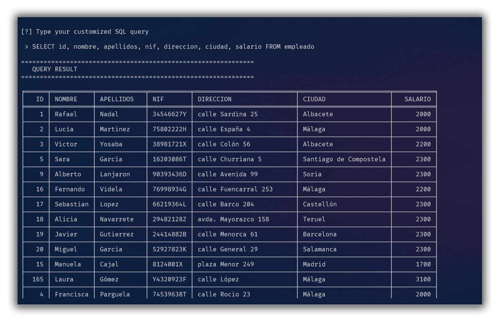

# LOBac SQL
[](https://lbesson.mit-license.org/)    

Based on : [](https://doi.org/10.5281/zenodo.3883946)

LOBac SQL is a lightweight MySQL database manager developed by a group of students from Málaga's University, forked from Apollo SQL.

This CLI program written in Python allows you to connect to remote database to query and relate data with predesigned queries (modify [`custom/queries.sql`](custom/queries.sql) and [`custom/db_data_.py`](custom/db_data_.py)), show whole tables, and insert data into them.

## Requirements

- [Python 3](https://www.python.org/downloads/)
- [MySQL connector](https://dev.mysql.com/downloads/connector/python/)

## Installation

```bash
git clone https://github.com/LOBac/LOBac-SQL.git
```

## Usage

The usage is pretty simple, just launch the [`main.py`](main.py) file:

```bash
python main.py
```

It works with a CLI (command-line interface), so you just need a command line to work with it.

In the first start, you will need to setup in settings the following connection parameters:

- `host`
- `port`
- `database`
- `username`
- `password`

The settings persist in memory in the `config.ini` file, which will be created automatically on first start.

## Demo

Here are some examples from the interface (main menu, settings, and a query) running on Windows Powershell 5.1:


The program also allows to perform customized queries from the menu:



## External packages (included)

The program uses external open-source packages (license included in every package in [`extra/`](extra/)):

- [tabulate 0.8.7](https://pypi.org/project/tabulate/)
